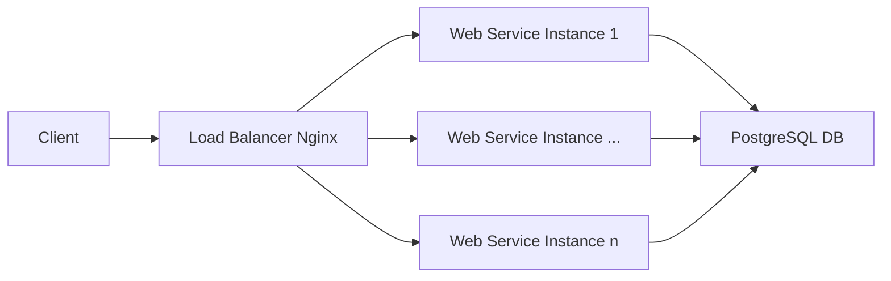

# Student Grading Service Architecture

## Overview

This document describes the architecture of the Student Grading Service, including API endpoints, database schema, and the use of Docker for scaling. The service is designed to be scalable and consistent, allowing multiple instances to be spun up as needed.

## API Endpoints

### Student Endpoints

- **Create Student**
  - **URL**: `/students/`
  - **Method**: `POST`
  - **Description**: Creates a new student.
  - **Request Body**: `{ "name": "John Doe" }`
  - **Response**: `{ "id": 1, "name": "John Doe" }`

- **Get Students**
  - **URL**: `/students/`
  - **Method**: `GET`
  - **Description**: Retrieves a list of all students.
  - **Response**: `[ { "id": 1, "name": "John Doe" } ]`

### Subject Endpoints

- **Create Subject**
  - **URL**: `/subjects/`
  - **Method**: `POST`
  - **Description**: Creates a new subject.
  - **Request Body**: `{ "name": "Math" }`
  - **Response**: `{ "id": 1, "name": "Math" }`

- **Get Subjects**
  - **URL**: `/subjects/`
  - **Method**: `GET`
  - **Description**: Retrieves a list of all subjects.
  - **Response**: `[ { "id": 1, "name": "Math" } ]`

### Grade Endpoints

- **Submit Grade**
  - **URL**: `/grades/`
  - **Method**: `POST`
  - **Description**: Submits a grade for a student in a subject.
  - **Request Body**: `{ "student_id": 1, "subject_id": 1, "grade": 85 }`
  - **Response**: `{ "message": "Grade submitted successfully" }`

- **Get Grades by Subject**
  - **URL**: `/grades/subject/{subject_id}`
  - **Method**: `GET`
  - **Description**: Retrieves grades for a specific subject, including the number of students graded, the average grade, and the median grade.
  - **Response**: `{ "number_of_students": 10, "average_grade": 75.5, "median_grade": 78 }`

- **Get Grades by Student**
  - **URL**: `/grades/student/{student_id}`
  - **Method**: `GET`
  - **Description**: Retrieves grades for a specific student in all subjects, including the student's average grade.
  - **Response**: `{ "grades": [ { "subject": "Math", "grade": 85 } ], "average_grade": 85 }`

## Database Schema

### UML Diagram

```plaintext
+-----------------+
|     Student     |
+-----------------+
| - id: Integer   |
| - name: String  |
+-----------------+
| + __init__(...) |
+-----------------+

+-----------------+
|     Subject     |
+-----------------+
| - id: Integer   |
| - name: String  |
+-----------------+
| + __init__(...) |
+-----------------+

+-----------------+
|      Grade      |
+-----------------+
| - id: Integer   |
| - student_id: Integer |
| - subject_id: Integer |
| - grade: Integer |
+-----------------+
| + __init__(...) |
+-----------------+
```



```plaintext
          +------------------------+
          |   Load Balancer (Nginx)|
          |                        |
          +----------+-------------+
                      |
                      v
        +------------+-------------+
        |                          |
+--------+--------+         +-------+--------+
| Web Service (1) |         | Web Service (2) |
|   (Flask API)   |         |   (Flask API)   |
+--------+--------+         +-------+--------+
        |                          |
        +------------+-------------+
                      |
                      v
          +----------+-------------+
          |                        |
          |      PostgreSQL DB     |
          |                        |
          +------------------------+
```
Well....